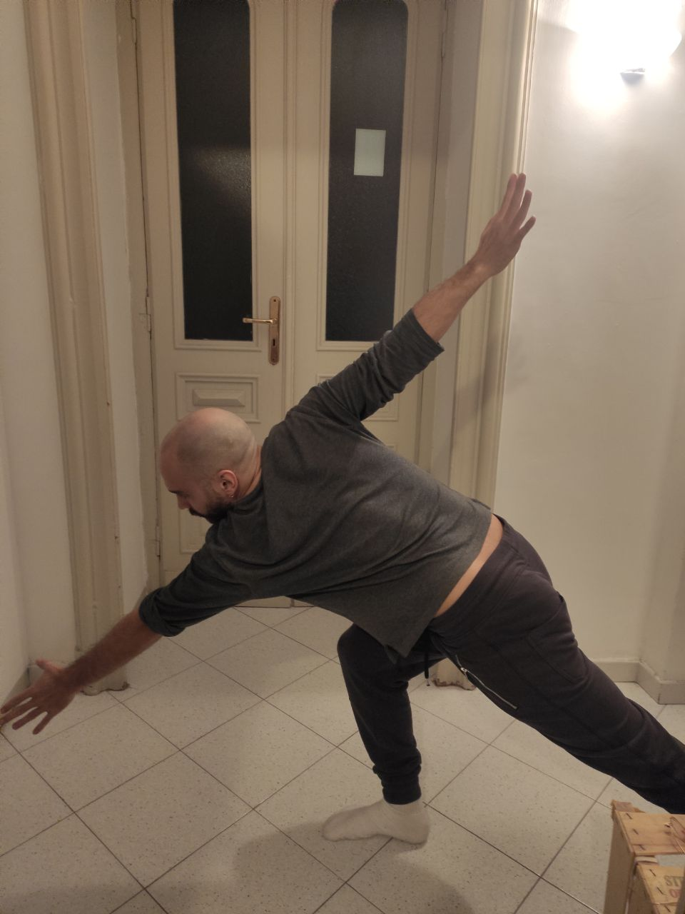
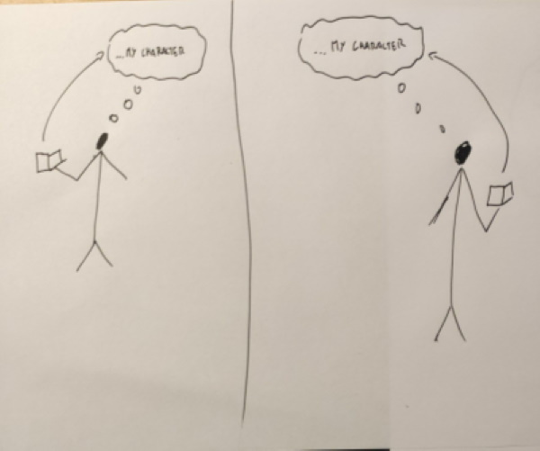
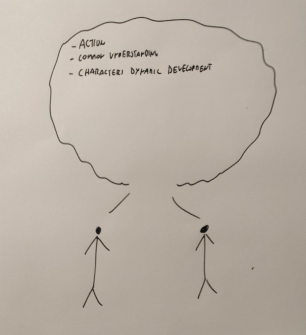
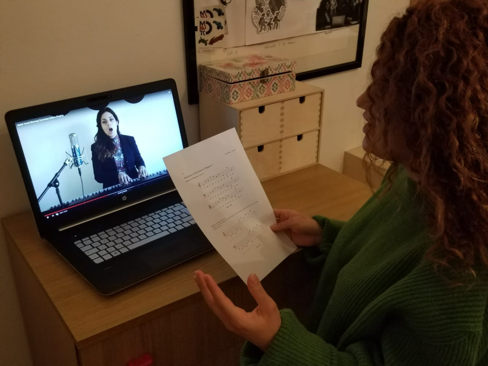
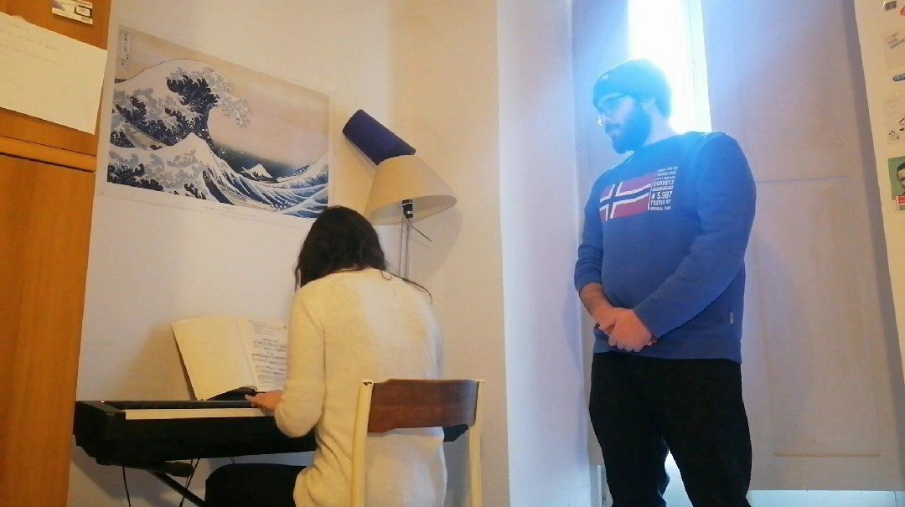

# Milestone 1: Project description and Needfinding: Figaro

# Overview and planning

List of "kind" of people:  
- Professional actor
- Actor in training  (in academia)
- Amateur actor
- Age: 20 - 50
- Technically well equipped: must have a smartphone

List of potential activities:  
- Daily (or regular) practising 
- Reharsing for a performance
- Working on a script (preparing a performance based on a script)
- Performing on stage

Chosen activity: `Daily (or regular) practising`  
Specifically, what does an actor do in his daily life to fulfill his profession and improve his/her skills, set aside working specifically on a show or project. We are interested in activities that are performed on a daily (or regular) basis.  

Pre-defined questions:  
- How often do you practice?  
- Are exercises to be performed in group or individually?  
- What kind of exercises does your daily practising consist of?  
- What is the ideal condition or environment for this activity?  

So, to summarize, we want to observe 3-4 `actors (Who)`, while they ` perform daily (or regular) practising (What)`. The observations will be possibly conducted in person or remotely `wherever this activity usually takes place (Where)`, during an `actual exercise session (When)`, by `looking at them (passive observers) and interviewing them (How)`.

# Observations
## Observation 1 - Professional actor  

### “Scompenso” and “Cechov’s Forms”  

#### Brief explanation

The exercise is usually performed during the actor’s academic training, but it can also be a good daily routine. The exercise aims at wash out any “social influence” over a person’s movement and behaviour, so that it can be turned according to the character the actor intends to embody. The subject take a “neutral” position shown in picture. Ankles are lightly flexed and arms just are in a neutral position around the hips.

Chechov's forms exercise is similar but are more focused on how the body can express direction, expansion in space and other things.

#### Observation description 

##### “Scompenso”
The subject just stands still in this position and in complete silence for 20 minutes.

The subject then starts running around. By “running” one does not mean light running as you expect, but it is a free, restless movement, with much emphasis on hip’s movement. This step lasts 15 minutes.

The subject comes back to the neutral position.

The previous steps are repeated 4 times.

##### Cechov’s Forms

The participant slowly poses in three different positions, one represents expansion, one closeness and one direction. The latter is shown in picture

	
	

Performance of one of Checov's forms. The practitioner has to perform very precise and difficult poses. Usually it is quite hard (especially for a academia trainee) to assume the right pose without the help of a tutor.

---

## Observation 2 - Professional actor  

### Etjude  

#### Brief explanation

Etjude’s technique is an actor’s tool to bring a certain character to life by analyzing the script, and to test the given interpretation of a certain character with other actors impersonating other characters. In this theoretical framework, an actor first makes a `theory` of her own character in the given script.
The actor’s job is to drill down the character’s interiority and give life to a deep character that is formed by all the things it goes through, expressing them in every smallest movement. The process is described as searching hints in the text, just like a detective finds hints on the crime’s scene. 

#### Observation description 

The observation has been conducted by having the subject thinking outloud while reading a script and explicitly stating crucial characteristics of his character. Then the subject tried out possible reactions to different situations in which his character might get through in terms of facial expression, movement, basic actions such as picking up a pen or shutting a door.

	
	
	

The images represent a sketch of the process of the etjude framework. First the actors study individually their charcaters. Then they test the their theories togheter by impersonating totally the character, creating action, testing commong understanding and triggering dynamic characters development.

---

## Observation 3 - Amateur actor  

### Voice  exercise

#### Brief explanation

Actors have to train their voice doing some exercises that are basically the same as those the singers do. Mainly the subject sings some scales going up or down of one tone at one time. This helps transitioning between voice regimes and reaching higher and lower notes in their vocal range. Doing these kind of exercises improve the performance quality over time.

#### Observation description

The subject opens a video on youtube of a teacher explaining a singing exercise and takes a paper with musical partitions on it, then it proceeds to sing along with the teacher on the youtube video. Then it continues the exercise explained by the video with the scales she has on the partitions.

	
	

The subject mimics a singing class by watching a youtube video where a teacher explains an exercise. Then she generalizes the exercise to her need by checking a partition with tailored scales.

---
# Interviews
[Report here the list of questions you prepared and, eventually, made to each person you interviewed. Then, summarize their answers.]

## Interview 1

- How often do you practice?  

This kind of activity should be performed once a day, I usually can stick to 5-6 times a week.

- Are exercises to be performed in group or individually?  

It depends, some exercises are individual, but also group exercises exist.

- What kind of exercises does your daily practising consist of? 

It depends. My daily routine of exercises are always different. Some focus on movement, some on voice, some on language and facial expression. It also depends on whter there is an upcoming show I have to prepare for and which kind of role I have to play.

- What is the ideal condition or environment for this activity?  

Ideally the exercises should be performed in a large and silent room (especially if it is a group exercise), with nobody watching or hearing. The sensation of being watched or heard during an exercise in which you should not be watched or heard is really bad for practising. Of course, there are exercises that can be performed at home with restricted space.

---

## Interview 2

- How often do you practice?  

Daily. But for each session I perform different exercises

- Are exercises to be performed in group or individually? 

This one I shown you should be performed individually in the first phase, in group in the second. 

- What kind of exercises does your daily practising consist of? 

The kind of exercise I shown you is the most frequent before reharsals and shows. In other situations there are many other kind of exercises. For example it can happen I have to dance for a show, so I have to practice movement and stay fit.

- What is the ideal condition or environment for this activity?

Individual exercises can be executed at home easily. Group exercises require much more space obviously.

---

## Interview 3

- How often do you practice? 

Most of the days. Depends on upcoming shows.

- Are exercises to be performed in group or individually? 

It depends on what you're exercising in. Many exercises are individual, some collective and some others require the presence of a tutor/teacher.

- What kind of exercises does your daily practising consist of? 

I mainly practise my voice and dance skills (I do musicals).

- What is the ideal condition or environment for this activity?

I usually practice at home, but for collective exercises we need large rooms.

# User Needs

## 1 Pose exercises feedback
An actor practices very peculiar and difficult movements to train. To do these exercises effectively, he/she needs an external viewer to check that he/she is doing the exercise well. He/she needs a way to practice this kind of exercise individually without losing feedback.

---
## 2 Remote interaction with other actors
Actors often have to practice in group. Sometimes group sessions are hard to plan in the current situation. Groups of actor need a way to have group sessions remotely in a way that satisfies the specific needs of actors.

---

## 3 Etjude theories interaction
The actor needs to compare his own theory of a character with another actor’s theory of another character, to test the coherence of his/her own theory within the script.

To practice impersonalization and immersion into a character, an actor needs to work with other actors that are working on the same script, focusing on the corresponding characters. For the activity to be succesful, all the agents in this situation have to extract the "acting essence" of their characters and let these "character theories" interact with each other to test the "jam" and the collective understanding of the scenic action. He/she needs a way to replicate the situation without others actors.

---

## 4 Reharsing environment 
A performer or a group of performers need a dedicated, private, silent and usually large space to reharsal, individually or in group. He/she needs a way to recreate a similar environment at home, given the current situation.

---

## 5 Tutored vocal exercise
Singers and actors need to train their voice daily to improve their skills. To do vocal exercises, she needs the teacher to be present and very often needs a piano. She needs a way to train without a teacher present and/or a piano.

---

# Project Description

The project addresses the need for a **voice training tutor.** The tutor helps the actor do vocal exercises to train their own voice on musical scales.
The tutor has to make sure the pitch and volume that the actor sings is right and that he/she is keeping the voice clean and is not "forcing" his/her voice.

The solution is well explained by the contrast of the two following images.

	
	
	

On the left we have a depiction of the normal execution of a vocal exercise. The teacher palys the notes, the student sings back and the teacher gives feedback on the performance. As one can see from the picture, the execution of this exercise requires a piano and the teacher to be present, which is not always the case. It can be the case that a practitioner will use other tools to perform these exercises, such as a youtube video, as depicted in the second picture (right).

The goal of the project is to recreate, as better as possible, the situation on the left picture without having a piano and the presence of the teacher, without losing the possibility to receive feedback and having tailored exercises.

The main value of the proposed solution is the possibility to execute singing exercise without the need to have a piano at home or being directly observed and tutored by a singing teacher, and to track the improvements on the execution of these exercises. 
The exercises may be proposed by the tutor or created by the user.

