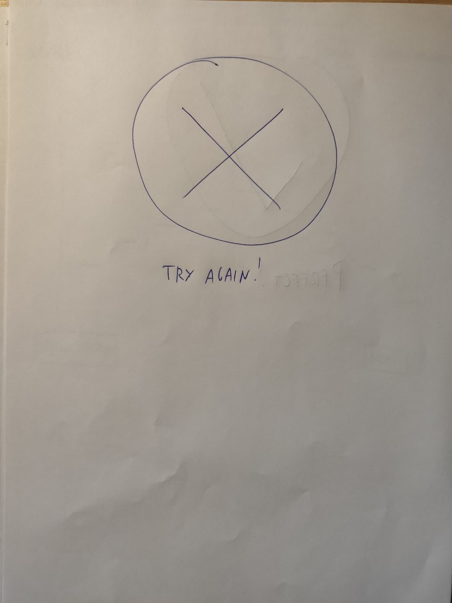

# Milestone 2: Low-Fi Prototyping - [Figaro]

## Storyboard :camera:

	
	 

1) - The user needs to clear his voice to act
2) - The user plans to use the "figaro" application
3) - The application asks the user to repeat some notes and plays them
4) - The user sings some notes while the application hears them
5) - The application displays an error message, and asks the user to repeat the notes it plays
6) - The user sings the notes again while the application hears them
7) - The application confirms that the notes sung are the same as those played
8) - The user is ready to act 

We have chosen to draw this storyboard because it represents the scenario in which an actor is involved during the early stages of his rehearsal. As it came out during the M1, a proper vocal control is a basic requirement for an actor and therefore we want to support him in improving this quality by providing a precise and intuitive way to recognize a scale of tones and to control volume and voice cleanness and give a feedback to the user. The strenght points, in our opinion, are the opportunity to show the progress of the user (as we haved noticed during the interviews reaching that level of control is a long path and needs daily trainings) and the portability of this feature, since an actor may want to have a last minute warm up.
On the other hand, we recognize that this will support the actor only in a partial part of the whole rehearsal session.

## Paper Prototypes

The project addresses the possibility to execute singing exercise without the need to have a piano at home or being directly observed and tutored by a singing teacher, and to track the improvements on the execution of these exercises. So as depicted in the story "Figaro" checks your vocal exercises and gives feedback on its correctness.

Alternative ways of the project goal are the exercises proposed by the application (First Prototype) or created manually by the user via virtual piano (Second Prototype).

Target devices: smartphones and tablets.

### FIRST PROTOTYPE

<table style="padding:10px">
  <tr>
  Main page includes:
  <li>Different types of exercises proposed by the application 
  <li>Statistics button, that will lead to statistics page
    <td>Main Page
		
	</td>
    <td>Click on Begin button will lead to "Exercise"page
		
	</td>
  </tr>
</table>

<table style="padding:10px">
	<tr>
  	Exercise page:  application audio-produces the exercise and user sings in parrallel. Specific scales will turn red and green indicating wrongness and correctness of the user.
	  <li> "Listen again" button will reproduce the audio of exercise
	  <li> "Next" button will show next scales of the exercises
	  <li> Once all the scales of the exercise is done a page will be shown with sign "perfect" or "wrong" according to user average percentage output. 
  	<td></td>
  	<td></td>
  	<td></td>
  	</tr>
	<tr>
  	<td>Click on "Pause" pauses the exercise and leads to page where user can resume back the exercise or exit it
	  </td>
	<td></td>
	</tr>
</table>

<table style="padding:10px">
	Statistics page:
	 User can find here general information about his/her activity to track his/her progress and understand what to practice more. 
	 Back button leads back to main page.
  <tr>
    <td></td>
    <td></td>
    <td></td>
  </tr>
</table>

  

### SECOND PROTOTYPE
Second prototype is a virtual piano where user can create exercises to practice.

<table style="padding:10px">
  <tr>
  Main page: 
  <li>depicts already created exercises that are ready to practice
  <li>right-bottom corner button to add/create new exercises
  <li> long tap on exercise will open a modal with buttons "edit" or "delete" the exercise
    <td>Main Page
		
	</td>
    <td>
		
	</td>
    <td>
	Create exercise 
		
	</td>
  </tr>
</table>

<table style="padding:10px">
	<tr>
	<td></td>
	<td>tapig on piano adds notes</td>
	<td></td>
	</tr>
</table>

<table style="padding:10px">
	<tr>
	<td>Modifies notes string. 
	 Play, Stop, Step forward/backward, delete 1 note</td>
	<td>'Save' leads to page to add a title of the exercise</td>
	<td>Saves the exercise with typed name and leads to main page OR Cancels the saving</td>
	</tr>
</table>

<table style="padding:10px">
	<tr>
	Long tap on exercise opens modal where user can decide to edit or delete the exercise
	  "Edit" leads to "Create exercise" page with selected exercise data
	  "Delete" opens confirmation window.
	<td></td>
	<td></td>
	<td>'YES' deletes the exercise and leads to main page</td>
	</tr>
</table>

<table style="padding:10px">
	<tr>
	"Practice Now" button leads to Exercise page. Where application audio-produces the exercise with "Play" button. After which user, using microphone button, sings. During the process notes will turn to green/red according to correctness/wrongness of user output.
	<td></td>
	<td>From here user can navigate to Edit pageas well (upper right button).</td>
	</tr>
</table>

## Selection Rationale
The goal of the project is to create a tool that will substitute a need of a user to have piano at home (to produce a melody) and the presence of the teacher (to receive tailored exercises and feedback on progress).

We chose the Prototype 1 because it is focused on having the exercises ready to train your voice day by day and track your progress with respect to the P2, which is basically just a tool that can be used only if user knows already which exercises to do.

Prototype 1 is well structured, has the statistics overview and the application itself suggests exercises based on user's progress. So It is more efficient in terms of practice. On the scale exercise, user might be confused when does the system listen/record, but it can be solved by scales colors, text (which is not visible in the prototype 1). 

No need to add "creating exercise" feature from Prototype 2 because a part of target users (e.g. amateur actor) do not know what type of exercise to do daily and recognize notes (to play piano). 
 

>## PROS
### Prototype 1
 * standard voice exercises (scales, gammas) inside the app suggested to a specific user daily, according to his/her progress
 * no need for user to know how to read notes or to play piano
 * the statistics overview - way to track the activity and progress
 

### Prototype 2
 * schedule of the exercise is step by step, very minimal but still efficient
 * User enters manually desired melody (scale, gamma) to practice

>## CONS

### Prototype 1
* no option for a user to add manually an exercise
* on the scale exercise, user might be confused when the system is listening/recording

### Prototype 2
* user has to manually enter the melody. 'Forcing' user to know how to play piano and what kind of exercide to do.
* does not contain any statistics so user has no possibility to see his/her progress
