# Milestone 3: Wireframe and Heuristic Evaluation - Figaro

## Wireframe
This is a summary of the main views of the wireframe, with the clickable links hinted, to give a general description of the navigation among the pages. For the complete wireframe please check the [wireframe](files/Figaro_wireframe.pdf) and the [wireframe with hints](files/Figaro_wireframe_linkHints.pdf).

We've used the Balsamiq Cloud tool to create the wireframe, which allowed us to focus on the links between pages, with small overhead in terms of drawing the actual components of the page. [Here](https://balsamiq.cloud/snkybml/pmx0hby/r2278?f=N4IgUiBcCMA0IDkpxAYWfAMhkAhHAsjgFpQAM8A0lANoC6AvkA%3D%3D) the link to the project.

The wireframe was made according to [Prototype1](https://github.com/polito-hci-2020/figaro/blob/main/M2/milestone2.md#first-prototype) of M2, 
so we made no huge decision or change from M2 outcome regarding the Prototype1. 

<table style="padding:10px">
Main page consist of 
<li> Different type of exercises
<li> bottom menu (Profile configuration, statistics, the list of favorite/saved exercises)
  Navigation between pages:
  <tr>
    <td>
      Vocal Exercise button click->
      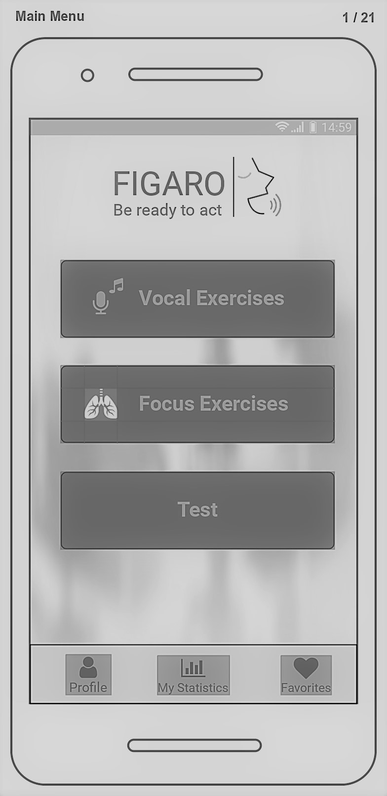</td>
    <td>
      an exercise select click->
      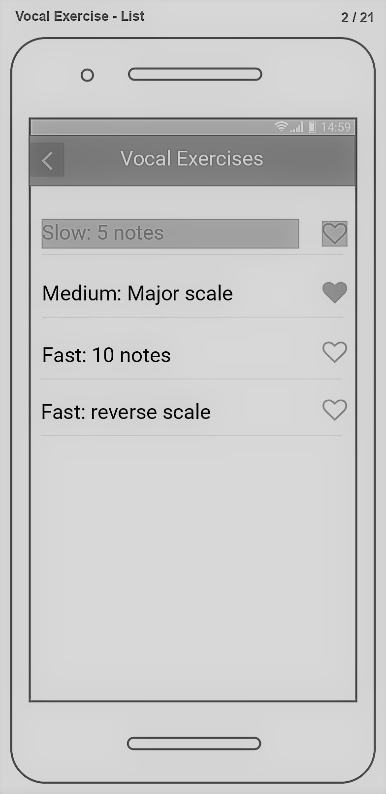</td>
    <td>
      play button click
      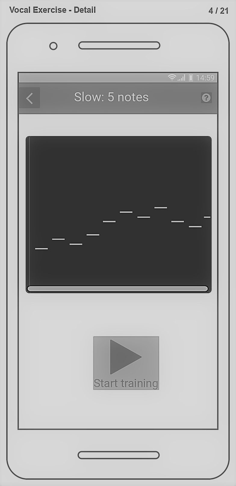</td>
    <td>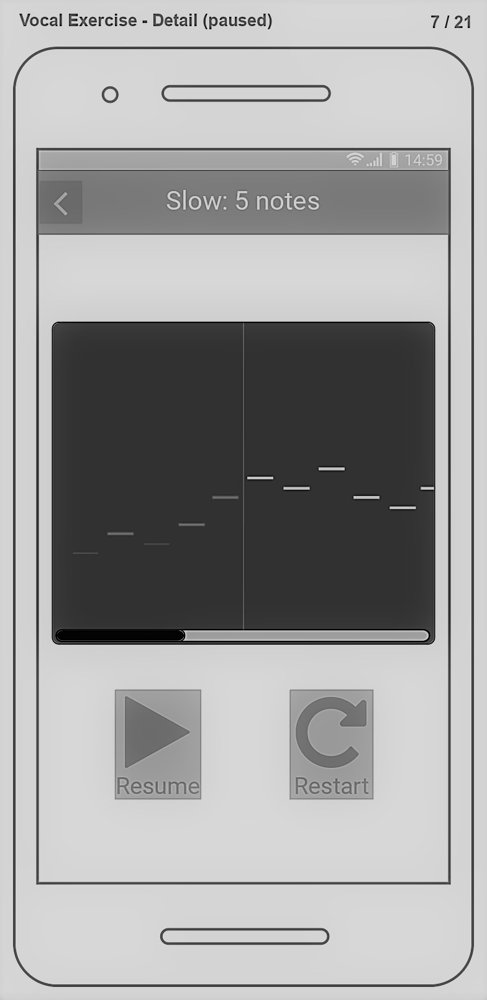</td>
  </tr>
</table>  
<table style="padding:10px">
  <tr>
    <td>
     Test click ->
      </td></td>
    <td>
      Countdown page -> exercises ongoing -> result page
      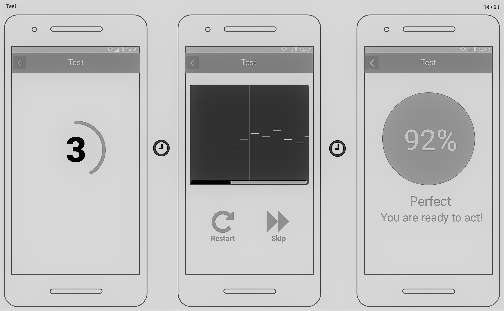</td>
  </tr>
</table>
<table style="padding:10px">
  <tr>
    <td>
    Profile click -> </td>
    <td>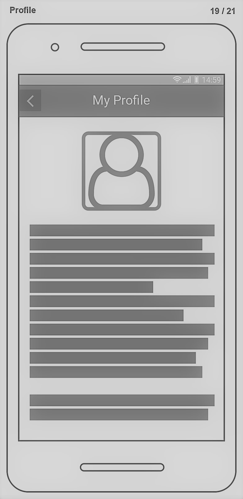</td>
  </tr>
  <tr>
    <td>
    My Statistics click ->
    </td>
    <td>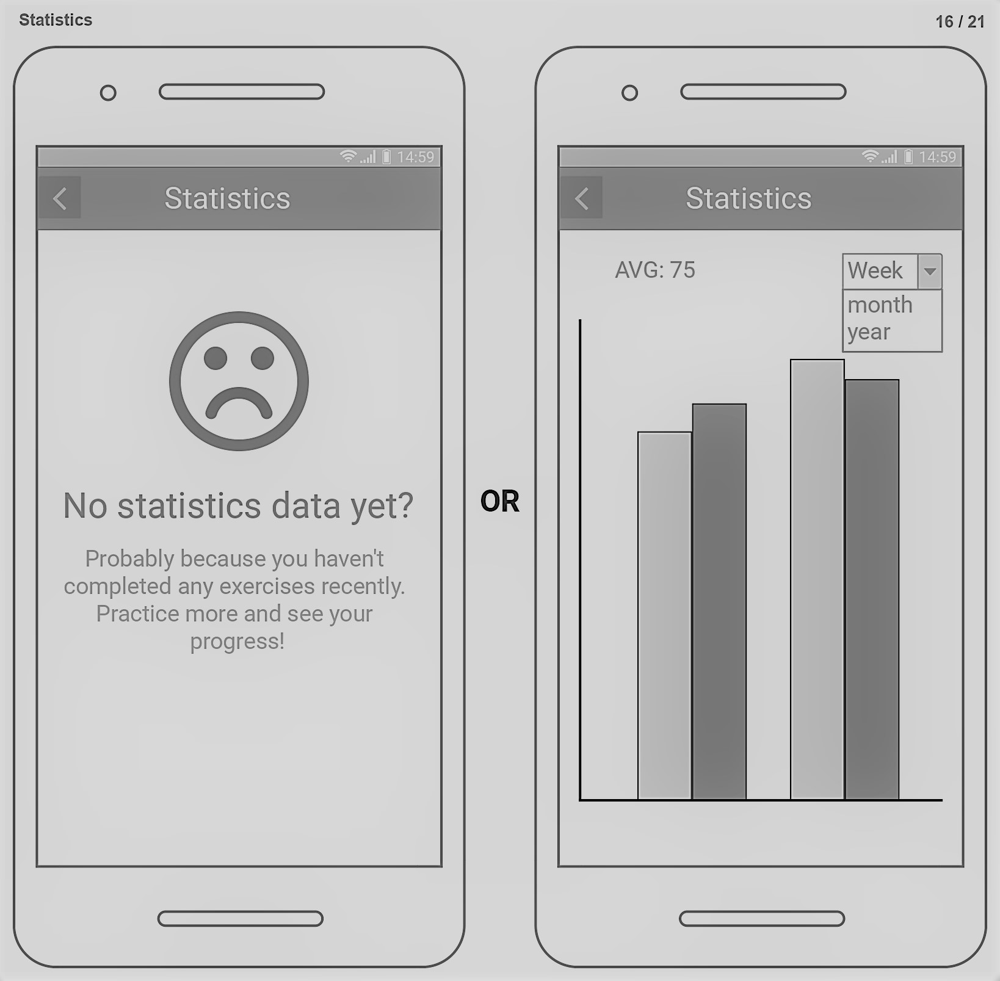</td>
  </tr>
    <td>
    My Favorites click ->
    </td>
    <td>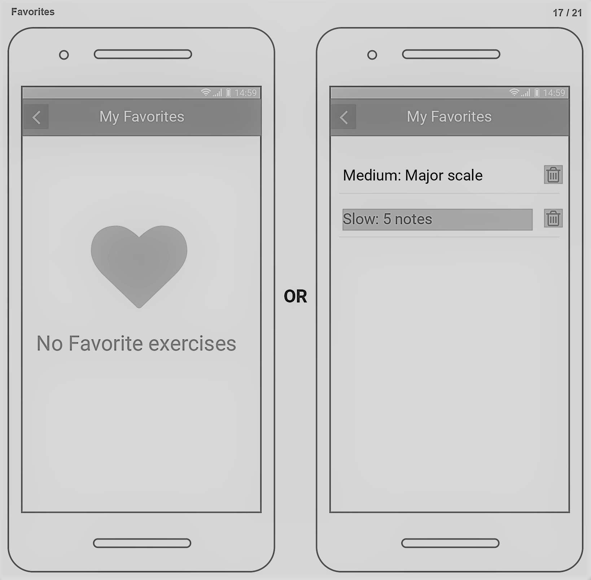</td>
  <tr></tr>
</table>

## Heuristic Evaluation

Our project "Figaro" was subjected to a heuristic evaluation conducted by two members of the "Seat 'n' Eat" team ( [Andrea Bruno](files/Evaluation1.pdf) & [Gaetano Prudente](files/Evaluation2.pdf)). 

We briefly explained the purpose of our application to the two evaluators and then we asked them to do some basic tasks (Task List is below).

Once the [balsamiq link] was shared, the two evaluators (in turn) tried to navigate the prototype interface and perform the suggested tasks, while evaluating the design of our application and stopping only to tell us their personal opinion.

Both evaluators completed the tasks without much difficulty, but during the navigation they encountered some uncertainties. For this reason, our team has decided to enclose the exercises in a single list.

Other suggestions received led to review some features of the prototype, to extend others (for example by expanding the "Profile" section) and to evaluate the possibility of changing some icons. All the decisions made by our group are shown in the Table below. 

## Task List
* Visit your profile
* Add a voice exercise to your favorites
* Choose a vocal exercise and evaluate your result
* Start a vocal exercise from your favorites list
* Delete a voice exercise from your favorites
* Start a vocal exercise from the list and stop its execution
* Do a breathing exercise
* Run the test with a list of exercises

<table>
<tr>
Some screenshots
  <td>
    Andrea Bruno
    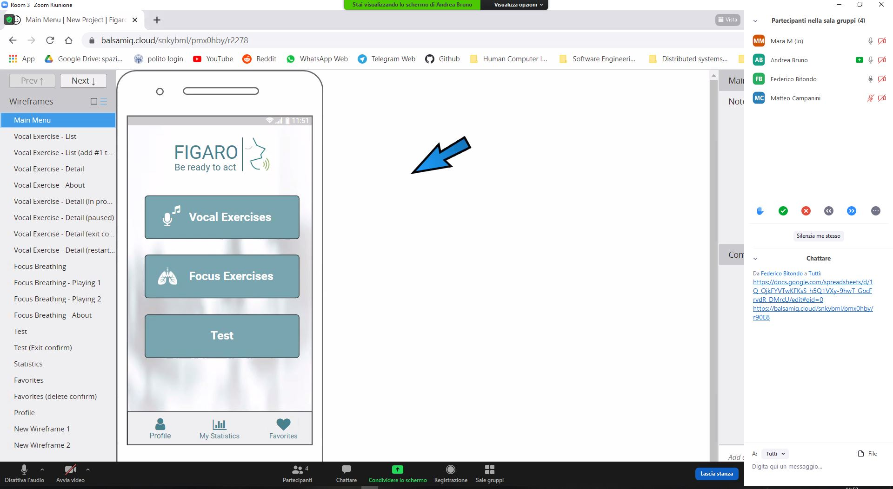</td>
  <td>
    Gaetano Prudente
    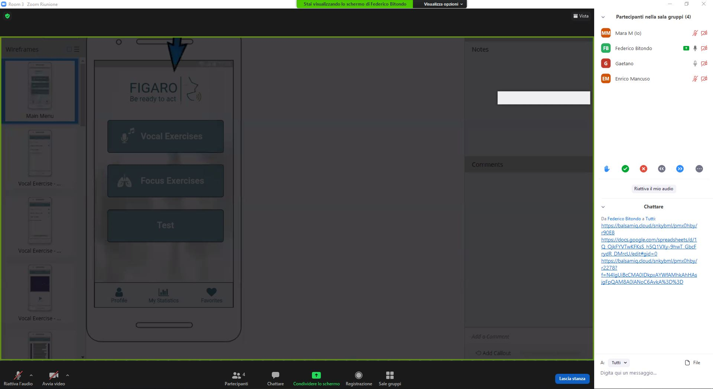</td>
</tr>
<tr>
  <td>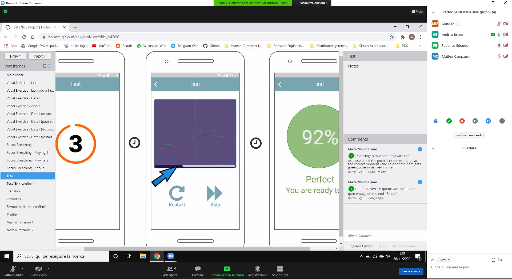</td>
  <td>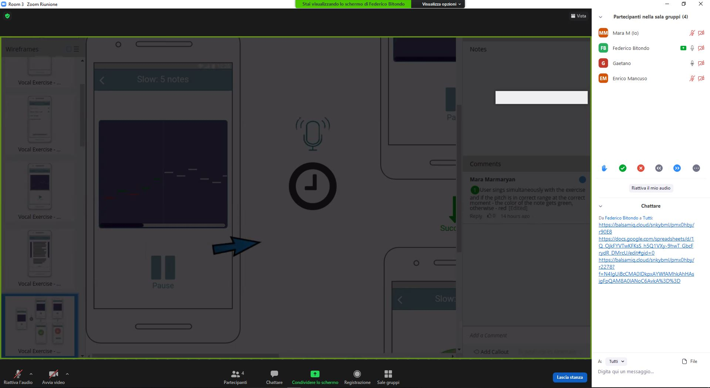</td>
</tr>
<tr>
  <td>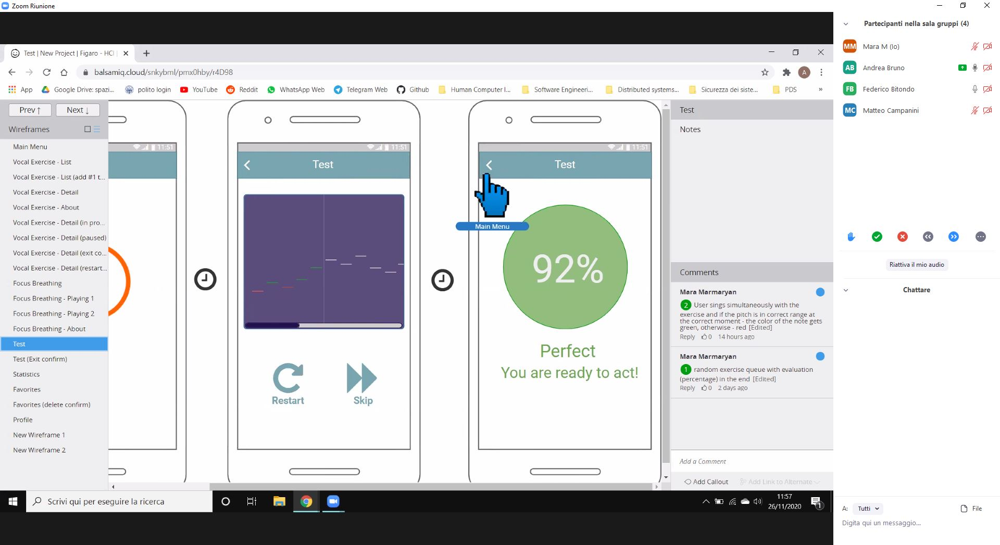</td>
  <td>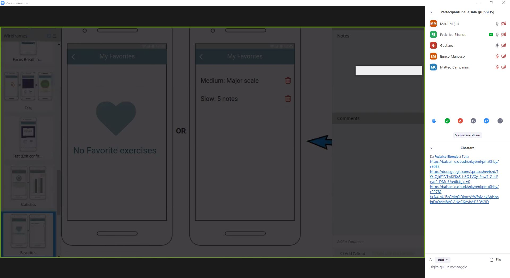</td>

</tr>
</table>

| Issue #       |  Heuristic #    | Description     |   Rating   |      Solution         |
| :------------- | :----------: | -----------: |     :----------: | -----------: |
|  1 | H1   | When a test/exercise is completed successfully, add a button to return back, and maybe leave the "try again" button if the user wants to repeat the exercise even if was done correctly.    |    2                |    The button will be added           |
|  2 | H2   | "Test" category may be misleading, it may seem to lead to a microphone hardware test  |    3                |  The button will be further clarified by stating "Test your skills" or something similar             |
|  3 | H4   | Ok/No buttons can have more descriptive names  |    1                |  The feedback is taken into account, but no direct action will be taken for now.             |
|  4 | H1/H4   | Exercises don't show the accuracy percentage of the execution, instead this value is shown during tests   |    2                |  The feedback is taken into account, but this point really depends on what actually the exercise will consist on, which is not directly specified by the wireframe. No action will be taken for now.            |
|  5 | H4   | In the "focus exercises" page, when a track is reproduced, there's no icon that shows the behaviour of the button (if the track stops and can be resumed, or if the execution can't be resumed)   |    2                |  The "focus exercises" will be taken down altogheter.           |
|  6 | NH   | In the "focus exercises" page, it may be useful to be able to restart the recording after pausing it, to be able to automatically resume the "playlist". Since this is a domain-dependent feature, it may not be useful, or even confusing to the user, so it may not even be a violation at all.   |    0                |  The "focus exercises" page will be taken down altogheter.           |
|  7 | NH   | In the "Statistics" page, the graph should explain what it's showing   |    1                |  The graph's description will be added. It is worth reminding that in the wireframe it is not specified which kind of data will be shown in the final application           |
|  8 | H8   | "Favorites": it would be better to have a crossed out heart, so i do not confuse myself thinkig that i am deleting the exercise   |    0                |  The icon will be changed.          |
|  9 | H1   | "Statistics": i would like to have details about each one of my tests (and the score of the exercises in that test)   |    3                |  Again, the actual information on the graph has not been specified yet, but we will improve the prototype to have different tabs to show history information in different ways.          |
|  10 | H2   | "Profile": i would like to be able to edit my informations or my profile image, so i'd like to see an edit button   |    2                |  The actual information you can insert and edit has not been specified. The "Profile" page is just a demo page that signifies that you wll have some personal information on the app. We concluded that implementing a whole profile settings page would have been an unjustified complication of the wireframe.        |
|  11 | NH   | "Test": i have no control on the tests, i would like to be able to choose between a random test, a suggested test (by the system algorithm based on my progress) and the list of available exercise   |    4                |  Again, the tests are just there as an example, the wireframe is not exaustive of the test system. No action taken.       |
|  12 | H2/H4   | "Test": the name in the home may be confusing about the purpose, it could a test for the app functionalities and for the hardware   |    4                |  The button will be clarified by stating "Test your skills" or something similar        |
|  13 | H7   | "Test": it would be good to be able to compose my test and select which and how many exercise i want on my test |    2                |  This really depends on what the app is supposed to do, like this the target may change, from practitioners to teachers. It can be a feature, sure, but this was not in the scope of the application.        |
| 14 |	H8 |	"Focus Exercises": i want to see the info buttons even if there is a track playing	|1 | The "focus exercises" page will be taken down altogheter. |
|15 |	NH|	"Focus Exercises" i have not much control on the track, it could be useful in terms of control to be able to pause (and not only stop the track), to be able to manage to playback speed and the manage how many times the loops are played	|3|  The "focus exercises" page will be taken down altogheter.|
|16|	H4 / H8 |	"Focus Exercises": the modal about the info focus exercise should be consistent with the modal in the voice exercise screen in terms of dimension and also about the info structure (for example: title, description, duration, difficulty level, ...)|	2 | The "focus exercises" page will be taken down altogheter.|
|17 |	NH |	"Voice Exercises": it would be nice to have a manually movable progress bar too, in order to manage the actual progess of the exercise and  actually have a control on the progress, right now if i want to go back or skip some parts in the exercise i can't and i have to restart it. It would also be nice to have control on the playback speed, so i can practice according to my needs |	4 | This feature depends onthe actual implementation of the exercises. No action taken. |
|18|	H8	|"Voice Exercises": on the pause screen of an exercise i would like to see the info button and not only on the "start" of the exercise screen|	1| The feature will be added |
|12 |	H4 / H8 |	"Voices Exercises": the modal about the info focus exercise should be consistent with the modal in the voice exercise screen in terms of dimension and also about the info structure (for example: title, description, duration, difficulty level, ...) |	2 | Modifications will be done to comply. |

Following the feedback received, we have made a number of decisions summarized below.
The "focus exercises" part will be deleted, deciding only later whether to permanently remove it or merge the functionalities to the exercise pages. The "test" section, with a somewhat ambiguous name, will be permanently removed. The favorites icon will be changed following the instructions received to avoid ambiguity and confusion. The "statistics" section will also be revised and will include a graph's description of the statistic. 

[this]: https://github.com/polito-hci-2020/figaro/tree/main/M3/screenshots
[balsamiq link]: https://balsamiq.cloud/snkybml/pmx0hby/r2278?f=N4IgUiBcCMA0IDkpxAYWfAMhkAhHAsjgFpQAM8A0lANoC6AvkA%3D%3D
